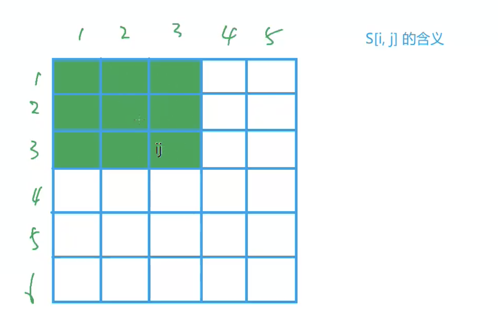
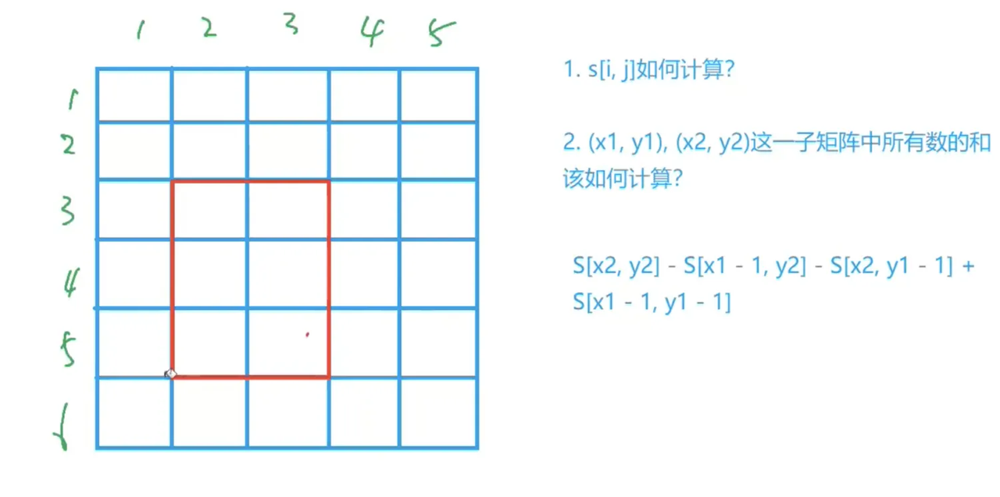
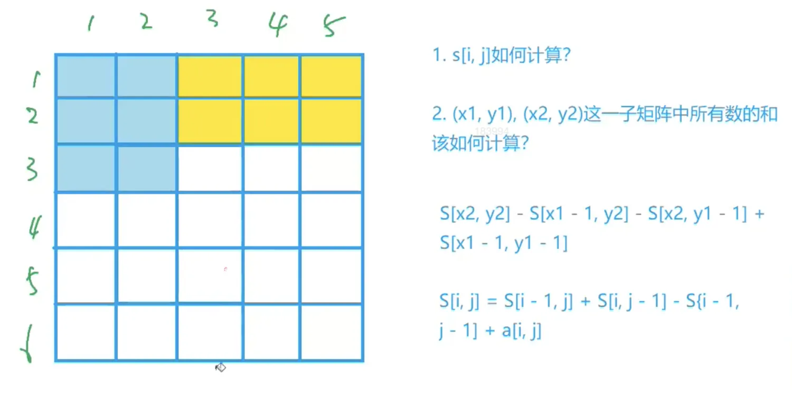
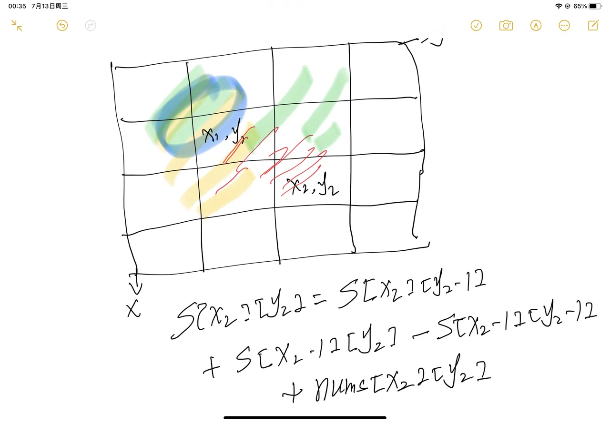
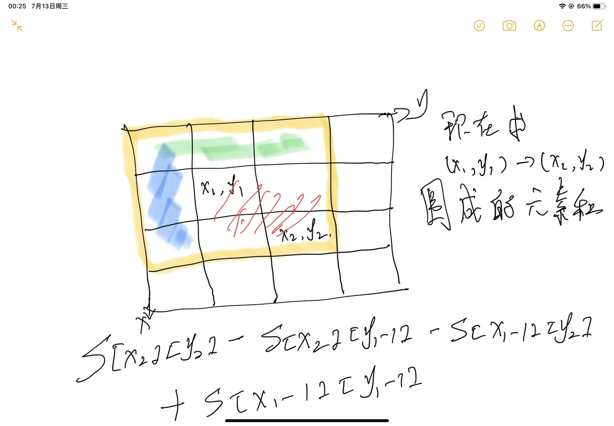
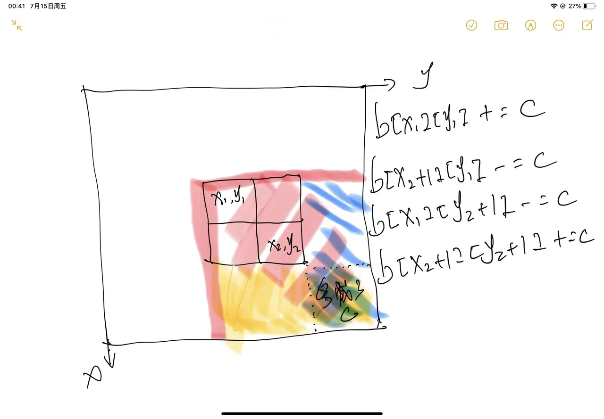

## 前缀和

原数组：a[1], a[2], a[3], ..., a[n]

前缀和：S[i] = a[1] + a[2] + a[3] + ... + a[i]，S[i]表示数组前i个和


注意：下标从1开始，可以直接定义S[0] = 0，这样做主要是为了方便处理边界问题。

例如：求[1, 10]区间的元素和，其实就可以等于S[10]，公式是：S[10] - S[0]


这里就涉及到两个问题：

问题一：如何求S[i]？

答：一个for循环，S[i] = S[i-1] + a[i]


```java
// preSum下标从1开始，nums下标从0开始的
for (int i = 1; i <= n; i++) {
  preSum[i] = preSum[i-1] + nums[i-1];
}
```


问题二：前缀和的作用是啥，即主要是为了解决什么问题？

答：作用只有一个，即快速求出原数组中一段区间的和。例如：[left, right]的元素和，使用前缀和的话，只需要使用**preSum[right] - preSum[left - 1]**


在使用前缀和之前，一般需要先构造前缀和

- 构造前缀和数组

```java
for (int i = 1; i <= n; i++) {
  preSum[i] = preSum[i-1] + nums[i-1];
}
```


- 求出区间[left, right]的元素和

```java
// 需要注意题目中的left，right是不是指nums数组下标，如果是，需要转换成preSum数组的下标，即left+1, right+1
preSum[right] - preSum[left-1]
```


## 二维前缀和

同样，下标从1开始

s[i, j]表示以(i, j)为右下角的矩阵中所有元素的和，如下图：




两个问题：

问题一：以(x1, y1)为左上角，(x2, y2)为右下角的子矩阵，所有元素和怎么计算？

答：s[x2, y2] - s[x1-1, y2] - s[x2, y1 - 1] + s[x1-1, y1-1]



问题二：s[i, j] 如何计算？

答：s[i, j] = s[i-1, j] + s[i, j-1] - s[i-1, j-1] + a[i, j]（伪代码，a数组的下标也是从1开始的）



代码实现：

- 构造二维前缀和

```java
for (int i = 1; i <= n; i++) {
  for (int j = 1; j <= m; j++) {
    s[i][j] = s[i-1][j] + s[i][j-1] - s[i-1][j-1] + nums[i-1][j-1]
  }
}
```




- 求和，左上角坐标为(x1, y1)，右下角坐标为(x2, y2)，求该区间元素和

```java
s[x2][y2] - s[x2][y1-1] - s[x1-1][y2] + s[x1-1][y1-1]
```




## 差分

即，前缀和的逆运算


假设存在a[1], a[2], a[3], ..., a[n]，构造b[1], b[2], b[3], ..., b[n]，使得a[1] = b[1], a[2] = b[1] + b[2], ..., a[n] = b[1] + b[2] + b[3] + ... + b[n]。

即，a为b的前缀和，b是a的差分


b[1] = a[1];

b[2] = a[2] - a[1];

b[3] = a[3] - a[2];

...

b[n] = a[n] - a[n-1];


现在想对a的[left, right]区间的元素都加上c，如果遍历a数组，那么时间复杂度为O(n)


由于a[left] = b[1] + b[2] + ... + b[left]，a[right] = b[1] + b[2] + ... + b[left] + b[left+1] + ... + b[right]

如果将b[left] + c，那么a的[left, n]的区间的元素都加上了c，再将b[right+1] - c，就可以实现将a的[left, right]区间元素都加上c，时间复杂度为O(1)


注意：差分是不需要构造的！

怎么理解"差分是不需要构造的！"


假设a原始都是0，那么b原始也是0，a数组可以看作是从原数组加了n个值，

即

第一次：区间[1, 1]加上a[1]

第二次：区间[2, 2]加上a[2]

第三次：区间[3, 3]加上a[3]


解题思路：

差分数组不需要构造的，假设a[1], a[2], a[3], a[4], ...，初始数组元素为0

那么a[1], a[2], a[3], a[4], ...，相当于循环了n次，第一次在[1, 1]区间上加上a1，第二次在[2, 2]区间上加上a2，以此类推


## 二维差分和

(x1, y1)和 (x2, y2) 表示一个子矩阵的左上角坐标和右下角坐标。将该子矩阵中的每个元素的值加上 c。输出最终矩阵




## 总结

一句话描述：做了这么多题的一个小结，总结下：什么情况下会用到前缀和。

前缀和的作用：

**作用只有一个，即快速求出原数组中一段区间的和**


什么情况下会使用前缀和：

1. 一般求和为xx的子数组的情况，例如：个数，最长/最短子数组等
2. 需要从题目中抽象出前缀和数组


知识点：

1. 无论是一维，还是二维，**下标都是从1开始**
2. 前缀和数组是有序的，生成前缀和数组的过程中，就已经保证了前缀和数组的有序性


题目类型：

- 前缀和
- 前缀和 + 二分法
- 前缀和 + 哈希表
- 选取一个数或者一个东西，满足一定的概率
- 差分
- 累计求区间的增量