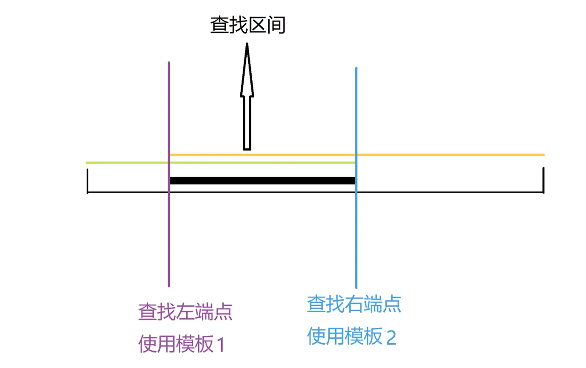

## 二分法


### 模板




### 代码

```java
public class Main {
    
    // 只有left = mid时，才会在计算mid时加1；
    // 将check(mid)看成右手，target看成左手，这是右手不断往左手靠近的过程，直到右手在左手的左侧
    // 因此这是求左边界，此时的右手就是左边界
    public static void function(int[] nums, int target) {
        int n = nums.length;
        int left = 0;
        int right = n-1;
        
        while(left < right) {
            int mid = (left + right) >> 1;
            if (check(mid) >= target) {
                right = mid;
            } else {
                left = mid + 1;
            }
        }
        return left;
    }
    
    
    // 只有left = mid时，才会在计算mid时加1；
    // 将check(mid)看成是右手，target看成是左手，这是左手不断往右手靠近的过程，直到左手在右手的右侧
    // 因此求得是右边界，此时的左手就是右边界
    public static void function(int[] nums, int target) {
        int n = nums.length;
        int left = 0;
        int right = n-1;
        
        while(left < right) {
            int mid = (left+right) >> 1;
            if (check(mid) <= target) {
                left = mid;
            } else {
                right = mid - 1;
            }
        }
        return right;
    }
}
```


```go
// 模板一 找到x的位置
for left < right {   // 是不是需要加=，如果数组大小为1
    mid := (left + right) >> 1

    // 理解成两个拳头，x是左拳头，check(mid)是右拳头，右拳头不断往左拳头靠近，当右拳头走到左拳头的左边，停止循环
    // 此时右拳头就是左边界
    if check(mid) >= x {   
        right = mid
    } else {
        left = mid + 1
    }
}

// 模板二 找到x的位置
for left < right {
    mid := (left + right + 1) >> 1
    
    // 同上的思考路径
    if check(mid) <= x {  
        left = mid
    } else {
        right = mid - 1
    }
}
```


### 总结

1. 我没必要按照以上的逻辑来做，二分法重点在于区间，我每次就考虑闭区间[l, r]，如果上述理解透，就直接按照上述的来
2. 有单调性，一定可以二分；但是可以二分，不一定需要单调性
3. 在写mid时，可以先不加上1，当发现 l = mid时，则需要在计算mid时加1