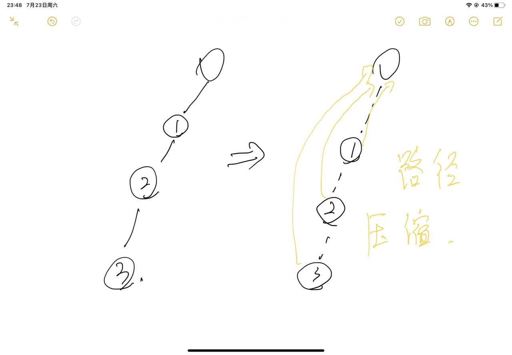

## 并查集

应用场景：

1. 将两个集合合并
2. 询问两个元素是否在一个集合中


近乎O(1)的时间复杂度内，支持上述两个操作。（近乎：路径压缩进行优化，可以做到）

基本原理：每个集合用一颗树来表示。树根的标号就是整个集合的编号。每个节点存储它的父节点，p[x]表示x的父节点。


问题1：如何判断节点是否是树根？ if (p[x] == x)

问题2：如何求x的集合编号？while (p[x] != x) x = p[x]

问题3：如何合并两个集合？假设px是x的集合编号，py是y的集合编号，那么p[x] = y，就表示x直接插入到y中


路径压缩：在判断x所属集合时，需判断p[x]是否等于x，在判断的过程中，我们将路径上的每个点的父节点都修改成集合的根节点。




代码实现：

注意，这里下标从1开始，不是规定，完全是为了好写，模板

```java
int[] p = new int[N];

void main() {
    // 初始化，初始时，每个节点的父节点是其本身
    for (int i = 1; i < n; i++) {
        p[i] = i;
    }
    
    // 将a所在的集合与b所在的集合进行合并
    p[find(a)] = find(b);
    
    // 判断a和b是否属于同一个集合
    boolean ans = find(a) == find(b);
}

// 返回x的祖先节点 + 路径压缩
// 整个并查集的核心！
int find(int x) {
    if (p[x] != x) p[x] = find(p[x]);
    return p[x];
}
```

